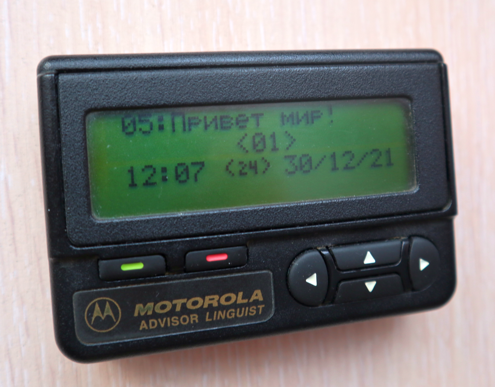
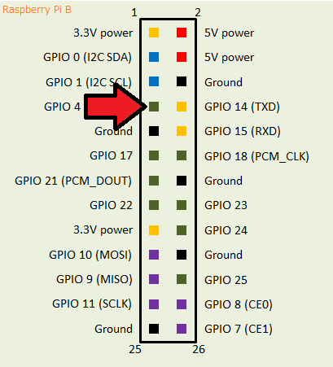
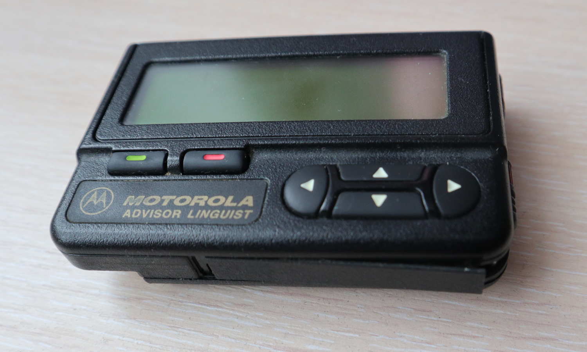
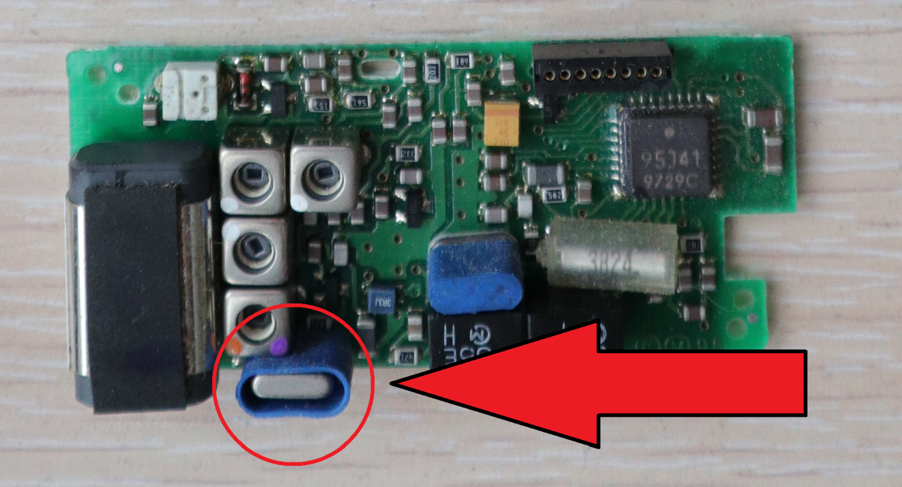
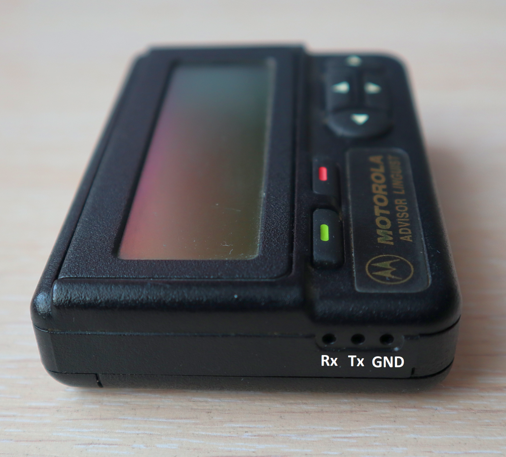
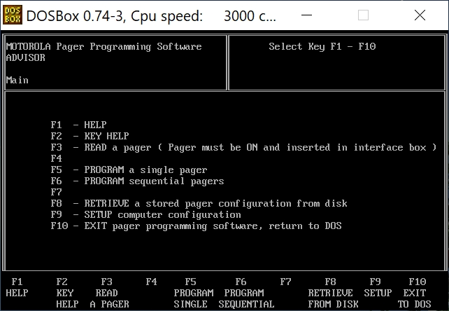
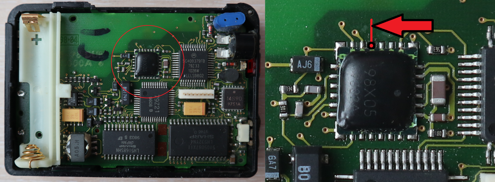
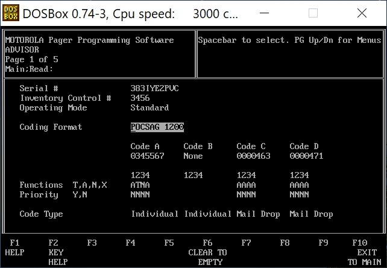

# Pager Station



# 📑 Содержание

- [Описание](#-описание)
- [Необходимое железо и системные требования](#-необходимое-железо-и-системные-требования)
- [Установка](#-установка)
- [Использование](#-использование)
- [Список литературы](#-список-литературы)

# 📜 Описание

#### *Что это такое?*

Это программа для организации собственной станции пейджинговой связи. С её помощью можно:
- отправлять на пейджер личные сообщения;
- автоматически скачивать из интернета и рассылать новостные сообщения (погода, курс валют, новости, заголовки RSS-лент, поздравления с днём рождения);
- управлять списками пейджеров, пользователей, новостных каналов; 
- (для программистов) полное управление через REST-API при помощи GET и POST запросов, для отправки сообщений из своих сервисов (из сторонних программ, мобильных приложений, умных колонок, итд);

#### *Какие пейджеры поддерживаются?*

По идее любые, но в основном предполагается работа с пейджерами модели **Motorola Advisor** (как на картинке в начале), так как по сути только он в наше время поддаётся перепрограммированию абонентских номеров (ну и ещё у него самый брутальный и узнаваемый вид, конечно же).

Работа с другими пейджерами возможна, только при условии что известны их частота и капкод, по этому принципу был успешно опробован двухстрочный пейджер Navigator.

#### *Где WEB-интерфейс???*

Возможно будет позже. Сейчас этот сервис - "бэкенд", то есть управляется или текстовыми командами, или из других сервисов (умных колонок). Проще говоря - автор не силён во фронтендах.

#### *А как запустить на умной колонке?*

В папке alice есть ещё один README, там описан процесс создания навыка.

#### *Нужен ли передатчик?*

В качестве маломощного передатчика используется Raspberry Pi, на неё же и предназначена для установки программа. 

При желании, можно передавать сообщения через внешний передатчик, при условии что им можно управлять из командной строки Linux.

#### *Какая дальность передачи?*

Дальность действия Raspberry Pi как передатчика (на скорости POCSAG 512) составляет примерно от 50 до 900 метров (очень сильно зависит от перекрытия стенами и домами).

Автор не особо силён в антенностроении, но эксперименты показали, что нет особой разницы, подключать в качестве антенны кусок провода, или заморачиваться с жёсткой вертикальной четвертьволновой - дальность действия будет примерно одинаковой. Длина антенны тут тоже особой роли не играет (конечно, слишком короткую не нужно делать, но разницы между 20см и 40см практически нет)

В случае подключения внешнего передатчика, конечно дальность действия уже будет ограничена только им, однако следует внимательно прочитать следующий пункт.

#### ❗ *ВНИМАНИЕ!!!* ❗

Следует помнить, что типичные частоты старых пейджеров лежат в коммерческих диапазонах, на которых незаконно вещать без лицензии.

Даже в случае применения маломощного передатчика Raspberry Pi, при постоянном вещании ваши действия могут не понравиться контрольным органам - она сильно фонит гармониками по соседним частотам.

Автор программы не несёт ответственности за последствия незаконного использования частот!

# 💻 Необходимое железо и системные требования

- Raspberry Pi (а также карта памяти и блок питания). Подойдёт практически любая модель, было успешно опробовано на самой первой версии "Pi B" 2013 года;
- Образ ОС на Raspberry Pi - самый последний (не ниже Bookworm 12)
- Собственно, сам пейджер Motorola Advisor, купленый на Авито во вменяемом состоянии;
- Переходник USB to TTL - можно купить например на Озоне. Выглядит как небольшая платка с USB на одной стороне, и несколькими штырьками с другой;
- Пара проводков с разъёмами "мама" под одиночные штырьки;
- Скорее всего, немного будет нужен паяльник (если пейджер окажется запаролен);

# 💾 Установка

1. Берём в одну руку Raspberry Pi, а в другую - проводок с разъёмом. Подключаем его к штырьку GPIO 4 (который седьмой по счёту) и оставляем болтаться - этот проводок у нас будет играть роль плохонькой антенны.



2. Записать на карту памяти образ ОС для Raspberry Pi (можно версию Lite без рабочего стола) с помощью программы Raspberry Pi Imager. В настройках записи не забыть: включить SSH, указать пароль к пользователю pi, указать часовой пояс.

3. Установить Git и склонировать себе проект

```bash
sudo apt update
sudo apt install git
git clone https://github.com/Galakart/PagerStation.git pagerstation
cd pagerstation
```

4. Запустить установку самой программы

```bash
./install.sh
```

В конце установки будет запрошено создание первого пользователя с доступом к API. Необходимо заполнить все данные, что он попросит. Последующих пользователей можно будет создавать уже через само API.

5. Открыть скрытый файл **.env** и внести в него настройки:
- OWM_TOKEN: для работы прогноза погоды. Нужно зайти на сайт https://openweathermap.org, зарегистрироваться там и создать API Key, который скопировать сюда;
- OWM_LATITUDE и OWM_LONGITUDE: координаты города для прогноза погоды;
- Параметр SECRET_KEY менять не нужно - он сгенерирован автоматически.

6. Перезагрузить Raspberry Pi для завершения установки. Сервис стартует автоматически.

Можно проверить, правильно ли установилась программа Rpitx (и вообще работоспособность Raspberry Pi как передатчика) командой:

```bash
echo "0123456:TEST" | sudo ./pocsag -f "159023000" -b 0 -t 1 -r 512
```

где:
- 0123456: капкод пейджера (7 цифр)
- TEST: текст сообщения
- 159023000: частота в герцах (159.023 Мгц)
- 512: скорость POCSAG. 

Если настроить частоту в пределах FM-диапазона, то передачу можно будет услышать на слух любым радиоприёмником.

Описание REST-API доступно по адресу http://ip-raspberry:8013/docs

Как работать с самой программой - читайте ниже, после раздела про перепрограммирование пейджера.

# 📟 Перепрограммирование пейджера

Желающие более плотнее ознакомиться с принципами работы пейджинговой связи, могут сделать это по ссылкам в конце этого текста. Тут я приведу только краткую выжимку.

Для начала ознакомимся с терминами:

- **абонентский номер**. Чаще всего - четырёхзначное число, присвоенное абоненту, чисто для удобства использования;

Его раньше называли оператору в телефоне, перед тем как надиктовать сообщение. Внутри пейджера никак не фигурирует (разве что только в строке информации). Сопоставление абонентского номера и капкода шло только у оператора.

- **капкод (CAPCODE)**. Уникальный номер (максимум семизначный) вшитый оператором в пейджер;

Именно на него передатчик шлёт сообщение, и именно он однозначно определяет, какое сообщение пейджер будет считать своим - принцип работы пейджинговой связи такой, что пейджер постоянно слушает эфир, и как только ловит принадлежащий ему капкод - то принимает и сохраняет следующее далее сообщение. Если это чужой капкод - то уходит в спячку до следующей передачи.  

Капкод и абонентский номер - это разные вещи, по той самой причине, что зная чужой капкод, можно запрограммировать свой пейджер на него и принимать чужие сообщения. Абонентский номер общеизвестен, капкод знает только оператор.

Капкоды бывают трёх видов - личные, групповые, и новостные. Новостные и групповые капкоды во все пейджеры зашиваются одинаковые, чтобы одну посылку могли принять сразу все. 

- **источник**. Число от 1 до 4, передаётся в связке с капкодом, и задаёт, условно говоря, его подкатегорию;

В личных сообщениях - можно раздавать разным абонентским номерам один и тот же капкод, делая различие только в номере источника. К примеру, задать капкод 123456 и источник 1 - как абонентский номер 1111, а тот же самый капкод 123456 и источник 2 - как уже абонентский номер 1112, принадлежащий другому человеку.

Ещё можно например зашить в пейджер, что сообщения принятые на капкод 123456 и источник 2 - будут приниматься с принудительным громким оповещением, независимо от настроек беззвучности пейджера.

Касаемо новостных сообщений - можно делать различие в тематике. Например на капкод 456 и источник 1 будет приниматься прогноз погоды, а на тот же капкод 456 и источник 2 - курс валют.

- **кодировка текста**. Какие языки поддерживает пейджер;

Бывает латинская, русская, и смешанная ("Linguist", у такой только заглавные буквы).

- **частота**. В мегагерцах, на которой пейджер принимает сообщения;

По сути, сообщения передаются в аналоговом виде - звуком по радиоволне, это можно услышать любым радиоприёмником, если задать частоту в пределах FM-диапазона.

**Для дальнейшей работы нам понадобится компьютер, на котором установлены:**

- DOSBox (ибо софт древний, написан под DOS);
- [Архив](https://drive.google.com/file/d/1ruwo3hAPavlnTYa16cZ9iX3iTPaVk4OW/view "Архив") с набором софта для перепрограммирования;
- возможно драйвера на USB-TTL переходник;

Для начала выясним частоту пейджера. Тут не всё так просто - да, можно посмотреть что написано на задней крышке, но проблема в том что местные операторы в большинстве случаев скручивали частоты под свои передатчики. Так что, чтобы полностью удостовериться в правильности частоты, пейджер нужно разобрать, благо это делается вообще без винтов.



Берём в руки пейджер, видим на нижней грани защёлку. Нам нужно с правой стороны её отогнуть ногтем от корпуса, а с левой толкать в правую сторону. Защёлка выйдет, после чего корпус распадётся на две половинки.  
Посередине мы видим плату, просто вставленную в гнездо. Это приёмник, нам нужно его отсоединить, и заглянуть вот сюда, под синюю обёртку.



Нужно глянуть, что написано на этом кварце - некое число вроде 47.041. Это частота кварца, и чтобы нам получить из неё частоту пейджера, нужно её умножить на 3 и прибавить 17.9.  
То есть, 47.041 * 3 + 17.9 = 159.023 МГц - частота нашего пейджера. Эта формула работает только для Motorola Advisor, с другими - только надеятся на удачу.

Настало время самой сложной части - перепрограммирование пейджера.

Снова берём пейджер в руки, и видим на его левом торце три отверстия, за которыми виднеются контакты. Это COM-порт, и через него мы будем подключать его к компьютеру. Контакты именуются, если слева направо и экраном вверх - Rx, Tx, GND. Соответственно, контакт для приёма данных, для передачи, и общий.



Затем берём в руки наш USB-TTL-переходник, и видим на нём, как ни странно, те же самые контакты. Так вот, нам нужно нацепить три провода с разъёмами на одноимённые контакты переходника, а с другого конца разъёмы обрезаем, зачищаем проводки, и подключаем их в отверстия пейджера. 

Подключение идёт попарно! То есть, Rx переходника в Tx пейджера, и Tx переходника в Rx пейджера. Общий провод, понятное дело, одинаковый. 

Как закрепить провода в отверстиях - тут уж как фантазии хватит. Главное чтобы при записи настроек контакт не нарушался, пейджеры этого не любят. Лично я делал так - приподнимал из корпуса основную плату с экраном, засовывал в отверстия корпуса проводки, затем опускал на место плату и она прижимала собой провода к контактам. Для надёжности можно прилепить их ещё изолентой к корпусу, чтобы случайно не вырвать. Главное чтоб контакты между собой внутри не замкнулись!

Вставляем в пейджер батарейку (можно его так и оставить полуразобранным, хоть с отсоединённым приёмником), и подключаем переходник к компу. Идём в Диспетчер устройств и запоминаем, на какой COM-порт у нас установился переходник (например, COM4). Если новых портов (кроме COM1-2) не появилось, то нужно установить драйвера на переходник.

Архив с ПО разархивируем в отдельную папку, нечто вроде `D:\DOS\AdvisorTools` 
Проверяем чтобы внутри папки AdvisorTools лежал файл ADVCNFGF.ILE - он определяет что ПО установлено нормально.

Открываем конфиг DOSBox (в Пуске пункт меню DOSBox Options). Открывается текстовый файл настроек. В самый низ вставляем:

```bash
mount C D:\DOS\AdvisorTools
```

И чуть выше ищем пункт, что-то вроде serial1=dummy. Меняем его на:

```bash
serial1=directserial realport:com4
```

соответственно, вместо com4 указываем номер вашего переходника.
Запускаем DOSBox, переходим на диск C в папку moto, и запускаем ADVISOR.EXE

```bash
C:
cd moto
ADVISOR.EXE
```



Первым делом жмём F9, переходим в настройки. Проверяем, чтобы пути соответствовали реальным (чтобы папка после C:\ действительно называлалсь "moto"), и чтобы был выставлен порт COM1. Если что, меняем, сохраняем, перезапускаем программу.

Жмём F3 - считываем данные из пейджера. Следим за переходником, во время передачи данных на нём быстро перемигиваются лампочки. Если это не так, или они не горят, то нужно проверить правильность всего вышеперечисленного, а также прочность контактов из проводков.

Здесь в большинстве случаев нас будет ждать облом - пейджеры почти всегда запаролены оператором от вмешательства. **ВНИМАНИЕ** - не стоит здесь пытаться подобрать пароль - пейджер выдержит несколько попыток, после чего заблокируется намертво (на нём будет гореть только надпись "ПЕЙДЖЕР ЗАБЛОКИРОВАН" или типа того) и его больше нельзя будет использовать даже как будильник!  
Однако ж, мы можем сбросить пароль (а также разблокировать пейджер, если всё же набедокурили здесь).

Для этого, отключаем пейджер от компа, разбираем его, и смотрим внимательно на основную плату:



Это микросхема памяти, нас интересует одна отмеченая ножка - четвёртая слева.

Расчехляем паяльник и АККУРАТНО (не спаяв соседние ножки) припаиваем тонкий проводок к этому контакту. Второй его конец зажимаем на минусовую пружинку батарейки (батарейку тоже вставляем). Этим самым мы нарушили связь пейджера с его собственной прошивкой, и на экране скорее всего будет отображаться всякий мусор.

Снова подключаем пейджер к компу и запускаем DOSBox. Переходим на диск C, в папку moto\pass и запускаем RSS.EXE

Нажимаем пробел - по экрану побегут цифры и через несколько секунд замрут. Следим за процессом, если цифры долгое время циклически повторяются, и каждый раз пейджер начинает истерично пищать - нужно остановиться и проверить качество припаянного проводка, так как при плохом контакте пейджер воспринимает взлом как попытки перебора пароля и блокируется как описано выше.

Если цифры замерли и больше не реагируют на пробел, закрываем программу, отключаем батарейку и провод от минусового контакта, и пробуем всё заново - вставляем батарейку, подключаемся через программу ADVISOR.EXE и пробуем считать настройки кнопкой F3.  
Разблокировка может пройти не с первого раза, поэтому провод от микросхемы не отпаиваем и пробуем ещё раз. Если настройки успешно считались, то провод можно отпаять (или оторвать) и забыть об этом - пароль сброшен. Точнее, сбрасывается не пароль, а флаг о том что нужно его запрашивать.

После всего этого, мы можем видеть (и менять) настройки, загруженные из пейджера. Они расположены на нескольких страницах, переключение между ними идёт по нажатию PageUp/PageDown. Все пункты настроек описывать не буду, только самые основные. На каждом пункте можно нажать F1 и прочитать, что он означает.



На первой странице мы видим в частности Serial # - серийный номер пейджера. Поменять нельзя, но можно сохранить куда-нибудь себе для аутентичности, в случае повреждения настроек пейджер спросит новый серийный номер. Кстати, этот же номер считывается со штрих-кода на задней крышке пейджера.

Выставим **Coding Format** - оно же скорость передачи. По желанию, к примеру **POCSAG 1200**. Скорость 512 - в два раза медленнее, но стабильнее и больше радиус приёма. 1200 посередине. 2400 соответственно ровно наоборот. Чтобы было примерно понятно - сообщение из 900 символов на скорости 512 передаётся примерно 15 сек.

Далее мы видим то, над чем придётся поднапрячь мозги - капкоды и их настройки. Более подробно вся эта тема раскрывается по ссылке в конце, в разделе использованных источников. В принципе, если неохота заморачиваться изменением капкодов, можно просто тут запомнить себе, какие капкоды зашил в пейджер последний оператор. Лишь бы были личные и новостные.

- У пейджера может быть 4 капкода (соответственно, Code A B C D), каждый из которых ещё подразделяется четырьмя источниками;
- Code Type - тип данного капкода
  + Individual - личный
  + Group - групповой
  + Mail Drop - новостной
- Цифры 1234 посередине - это обозначения источников;
- Functions T,A,N,X - как будет воспринято сообщение, принятое на данный капкод+источник
  + A - как обычное текстовое;
  + N - "числовое" (это про старую кодировку, передающую только цифры);
  + T - тональное (сообщение без текста, пейджер просто запищит);
  + X - сообщение будет отброшено (используется, если мы раздаём один капкод нескольким абонентам, и делаем различие только в источниках);
- Priority Y,N - сообщение с источником, отмеченным тут как Y, будет принято со звуковым сигналом, независимо от настроек беззвучности пейджера;

Не забываем про особенность новостных (MailDrop) сообщений - связка капкод+источник автоматом привязывается к ячейке памяти пейджера, и каждое новое сообщение перезаписывает старое. Таким образом мы имеем разделение новостных тем по разным ячейкам памяти, и в каждой теме актуальная новостная информация.

А теперь, главное внимание, особо мозговыносящая вещь!
Капкоды должны вручную задаваться не абы как, а должны правильно располагаться попарно в одинаковых фреймах (пачках передаваемых данных)! То есть, Code A и Code B должны располагаться в одном фрейме, Code C и Code D - во втором. Причём второй должен быть больше первого. Программа конечно предупредит, если что-то не так, но всё же знать надо. Нарушение этого приведёт к сокращению вдвое времени работы от батарейки - пейджеру придётся чаще просыпаться для проверки посылок.

Как узнать номер фрейма? Есть встроенный калькулятор, достаточно перейти по ссылке http://ip-raspberry:8013/capcode_to_frame/234, где 234 это номер предполагаемого капкода.

В ответ он выдаст номер фрейма
```
{"frame_number": 2}
```

Всего фреймов 8 (от 0 до 7). При увеличении капкода на 1, фрейм тоже увеличивается на 1, пока не дойдёт до 7, дальше отсчёт снова пойдёт с нуля. То есть к примеру, капкоды 525349 и 37 - относятся к 5-му фрейму, и их можно использовать в паре.  
По тому же принципу делаем вторую пару капкодов, к примеру 191 и 199 - фрейм у них будет 7-ой, и он больше чем 5-ый.
Ну и ещё - не рекомендуется использовать слишком мелкие капкоды (меньше 10).

**Если всё вышеперечисленное непонятно (я тоже долго не мог понять), то просто делаем как я:**

Капкод Code A задаём **0525349**, функции выставляем **ATXX**, приоритет **NNNN**, Code Type - **Individual**  
Капкод Code B задаём **0000037**, функции выставляем **AAXX**, приоритет **YNNN**, Code Type - **Group**  
Капкод Code C задаём **0000191**, функции выставляем **AAAA**, приоритет **NNNN**, Code Type - **Mail Drop**  
Капкод Code D задаём **0000199**, функции выставляем **AAAA**, приоритет **NNNN**, Code Type - **Mail Drop**  

Что мы имеем из всего этого?

- Сообщение на капкод **525349** + источник **1**  
принимается как личное в обычном текстовом виде;
- Сообщение на капкод **525349** + источник **2**  
принимается как личное в тоновом виде (просто запищит с надписью ТОНОВЫЙ);
- Сообщение на капкод **525349** + источник **3**  
будет отброшено;
- Сообщение на капкод **525349** + источник **4**  
будет отброшено;
- Сообщение на капкод **37** + источник **1**  
принимается как групповое с громким оповещением, независимо от режима беззвучности;
- Сообщение на капкод **37** + источник **2**  
принимается как групповое;
- Сообщение на капкод **37** + источник **3**  
будет отброшено;
- Сообщение на капкод **37** + источник **4**  
будет отброшено;
- Сообщение на капкод **191** + источник **1**  
принимается как новостное и будет храниться на экране во 2-ой строке и 9-ой ячейке (например, чисто для погоды). Каждое новое сообщение будет перезаписывать эту ячейку памяти;
- Сообщение на капкод **191** + источник **2**  
принимается как новостное и будет храниться на экране во 2-ой строке и 10-ой ячейке (например, чисто для курса валют);
- Сообщение на капкод **191** + источник **3**  
принимается как новостное и будет храниться на экране во 2-ой строке и 11-ой ячейке (например для... и так далее, каждая новостная категория в своей ячейке);
- Сообщение на капкод **191** + источник **4**  
принимается как новостное и будет храниться на экране во 2-ой строке и 12-ой ячейке;
- Сообщение на капкод **199** + источник **1**  
принимается как новостное и будет храниться на экране во 2-ой строке и 13-ой ячейке;
- Сообщение на капкод **199** + источник **2**  
принимается как новостное и будет храниться на экране во 2-ой строке и 14-ой ячейке;
- Сообщение на капкод **199** + источник **3**  
принимается как новостное и будет храниться на экране во 2-ой строке и 15-ой ячейке;
- Сообщение на капкод **199** + источник **4**  
принимается как новостное и будет храниться на экране во 2-ой строке и 16-ой ячейке;

Закончив наконец с капкодами, переходим на следующую страницу настроек (PageDown). На остальных страницах настраиваем всё по своему вкусу.

На третьей странице проверим чтобы **Data Inversion** стояла **No** (но вообще можно поиграться с этим параметром, если пейджер ни в какую не желает принимать сообщения).

На четвёртой странице можно задать собственные служебные строки - название оператора (к которому обычно дописывали абонентский номер, как напоминалка), или уведомления вроде "УДАЛИТЬ?" и "ЗАМЕНИТЕ БАТ.".

Наконец на самой последней странице, проверив что наш пейджер до сих пор включён и крепко подсоединён проводами, можно нажать F4 и запрограммировать изменения в пейджер. Если здесь будет нарушен контакт с проводами - настройки слетят, появится мусор на экране, придётся всё настраивать с нуля.

В случае успешного перепрограммирования пейджер перезагрузится, запищит, и на этом месте можно его отсоединять от компьютера, собирать обратно и переходить (запомнив конечно, что за номера мы в него внесли) к настройке собственно программы.

## 📣 Использование

Здесь и далее предположим, что установка прошла успешно, и наша Raspberry Pi имеет ip-адрес 192.168.1.50. После перехода по ссылке http://192.168.1.50:8013/docs в браузере, мы увидим полное описание и примеры в интерфейсе OpenApi.

Здесь очень много всего непонятного, какие то transmitters, hardware, зачем так много всего и как с этим работать? На самом деле тут всё довольно органично, у нас же тут PagerSTATION, то есть мы собираемся управлять зоопарком пейджеров с разными частотами, пользователями, номерами, и прочим.

В основном API сгруппировано по темам:
- Hardware: всё что связано с железом - передатчики и пейджеры;
- Channels: управление новостными и групповыми каналами;
- Users: клиенты и пользователи;
- Messages: работа с сообщениями;

Как я уже говорил выше, это бэкенд, то есть управлять им мы будем при помощи GET и POST запросов. Их можно проводить прямо тут в интерфейсе API, а можно из командной строки при помощи утилиты curl. В дальнейшем все примеры будут проделаны при помощи curl.

Далее я подробно опишу процесс настройки.

##### 1. Нам нужно авторизоваться в API;

Так как некоторые сценарии использования предполагают, что API торчит наружу в интернет (см. раздел с установкой навыка Алисы), то не совсем безопасно открывать полный доступ. Нужно защититься паролем, хоть какая то защита.

Если мы хотим авторизоваться в интерфейсе API, то для этого вверху справа есть кнопка Authorize. Там нужно будет ввести логин-пароль (которые мы вводили в конце установки сервиса), после чего API станет полностью доступным

Через командную строку: вначале запросим токен:
```bash
curl -X POST http://192.168.1.50:8013/token/ \
-H "Content-Type: application/x-www-form-urlencoded" \
-d "username=testov&password=qweqweqwe"
```
В ответ нам придёт access_token. Сохраним его, все дальнейшие запросы будем делать только с ним. Когда истечёт срок действия токена (1 сутки), нужно будет этой же командой получить новый.

##### 2. Создадим передатчик;

Смысл раздела "Передатчики" в том, что у нас может быть зоопарк пейджеров, каждый со своей частотой и скоростью приёма, где-то мы захотим как передатчик использовать саму Raspberry Pi, а где-то внешний передатчик. Всё это мы укажем при создании виртуального передатчика.

Касаемо внешнего передатчика - по сути мы предполагаем, что это некое самодельное устройство, подключеное к Raspberry Pi как com-порт, который может принять в себя текстовую команду (образец ниже). 

Для создания нам нужно задать параметры:
- **name:** название передатчика
- **freq:** частота в Гц (то есть, 159023000 для частоты 159.023 МГц)
- **id_baudrate:** скорость передачи (которую мы зашивали в пейджер). 512, 1200, 2400;
- **external:** если передатчиком будет Raspberry Pi, то ставим false, если внешний - тогда true;
- **external_command:** команда, которая будет исполнятся в командной строке linux при отправке сообщения. Если external=false, то оставить это поле пустым. Можно использовать шаблоны {capcode} {fbit} {freq} {id_baudrate} {id_codepage} {message} для подстановки параметров в команду;

Пример команды для создания передатчика (здесь и далее вместо слова TOKEN подставляем свой токен, полученный в абзаце выше):
```bash
curl -X POST http://192.168.1.50:8013/hardware/transmitters/ \
-H 'Authorization: Bearer TOKEN' \
-H 'Content-Type: application/json' \
-d '{"name": "Motorola","freq": 159023000,"id_baudrate": 512,"external": true,"external_command": "echo -c {capcode} -s {fbit} -f {freq} -b {id_baudrate} -u {id_codepage} -m {message} > /dev/ttyUSB0"}'
```

Просмотр всех созданных передатчиков:
```bash
curl -X GET http://192.168.1.50:8013/hardware/transmitters/ \
-H 'Authorization: Bearer TOKEN'
```

Удаление передатчика ("1" в адресе - это id удаляемого передатчика):
```bash
curl -X DELETE http://192.168.1.50:8013/hardware/transmitters/1 \
-H 'Authorization: Bearer TOKEN'
```

Все создаваемые элементы (в т.ч. те что описаны ниже) можно добавлять, изменять, удалять, просматривать (все или один выбранный).


##### 2. Создадим пейджер;

Зададим параметры:
- **id:** абонентский номер;
- **capcode:** капкод (для личных сообщений), который мы прошивали в пейджер;
- **id_fbit:** номер источника для личных сообщений (1, 2, 3, 4);
- **id_codepage:** кодировка пейджера (1 - lat, 2 - cyr, 3 - linguist). Сервис при отправке сам меняет сообщение в зависимости от кодировки, т.е. если отправлять русский текст на пейджер который поддерживает только lat, слова будут преобразованы в транслит. Наоборот так же;
- **id_transmitter:** id созданного выше передатчика;

Пример:
```bash
curl -X POST http://192.168.1.50:8013/hardware/pagers/ \
-H 'Authorization: Bearer TOKEN' \
-H 'Content-Type: application/json' \
-d '{"id": 1111,"capcode": 523468,"id_fbit": 1,"id_codepage": 2,"id_transmitter": 1}'
```

##### 3. Создадим пользователя (абонента);

Зададим параметры:
- **fio:** ФИО пользователя, или просто имя;
- **datar:** дата рождения. Сервис будет отправлять поздравления именинникам;
- **api_login и api_password:** если пользователю нужен полный доступ к API, можно здесь придумать логин пароль. Если это обычный клиент - не заполнять их;

Пример:
```bash
curl -X POST http://192.168.1.50:8013/users/ \
-H 'Authorization: Bearer TOKEN' \
-H 'Content-Type: application/json' \
-d '{"fio": "Иван","datar": "1991-07-12"}'
```

##### 4. Привяжем пейджер к пользователю;

Зададим параметры:
- **uid_user:** идентификатор созданного выше пользователя (можно посмотреть, если вызвать полный список пользователей);
- **id_pager:** абонентский номер созданного выше пейджера;

Пример:
```bash
curl -X PUT http://192.168.1.50:8013/users/pagers?uid_user=3fa85f64-5717-4562-b3fc-2c963f66afa6&id_pager=1111 \
-H 'Authorization: Bearer TOKEN' 
```

##### 5. Создадим новостные и групповые каналы;

Что же такое, все эти каналы?

Как мы знаем из теории о пейджерах из раздела выше, групповые и новостные коды во все пейджеры прошиваются одинаковые, чтобы они все принимали один и тот же текст. Однако, мы опять же имеем всё тот же самый зоопарк пейджеров, с разными частотами, скоростями приёма, кодировками, итд.

Здесь на помощь приходят каналы. Это по сути, набор связок "передатчик+капкод+кодировка", объединённых одной темой.

Поясню на примере. 
1. У нас есть передатчик Motorola с частотой 159.025 и скоростью 512, и ещё один передатчик Navigator с частотой 165.050 и скоростью 1200;
2. На капкод 151 мы собираемся посылать новости в кодировке lat, а на капкод 159 - в кодировке cyr;
3. Мы имеем один новостной текст на конкретную тему (о погоде), и хотим отправить его на все пейджеры;

И для этого мы можем создать 4 канала:
1. Передатчик **Motorola**, капкод **151**, источник **2** (ячейка памяти пейджера), новостная тема **2** (погода), кодировка **1** (lat);
2. Передатчик **Motorola**, капкод **159**, источник **2** (ячейка памяти пейджера), новостная тема **2** (погода), кодировка **2** (cyr);
3. Передатчик **Navigator**, капкод **151**, источник **1** (ячейка памяти пейджера), новостная тема **2** (погода), кодировка **1** (lat);
4. Передатчик **Navigator**, капкод **159**, источник **1** (ячейка памяти пейджера), новостная тема **2** (погода), кодировка **2** (cyr);

Как мы видим, из общего у этих каналов только новостная тема под номером "2" - погода. И теперь, если мы создадим одно сообщение с темой 2, оно будет разослано на все указанные передатчики, капкоды, с переводом в нужную кодировку, и уложено в указанную ячейку памяти пейджера.

Новостных тем в пейджере может быть 8 разных (ну или 16, если очень захотеть). Первые 4 (оповещения, погода, курс валют, новости) в сервисе предопределены под нужды встроенной рассылки (об этом чуть ниже), остальные можно использовать как угодно. 

Пока что просто создадим 4 канала на разные темы:

(для оповещений)
```bash
curl -X POST http://192.168.1.50:8013/channels/maildrop/ \
-H 'Authorization: Bearer TOKEN' \
-H 'Content-Type: application/json' \
-d '{"id_transmitter": 1,"capcode": 151,"id_fbit": 1,"id_maildrop_type": 1,"id_codepage": 2}'
```

(для погоды)
```bash
curl -X POST http://192.168.1.50:8013/channels/maildrop/ \
-H 'Authorization: Bearer TOKEN' \
-H 'Content-Type: application/json' \
-d '{"id_transmitter": 1,"capcode": 151,"id_fbit": 2,"id_maildrop_type": 2,"id_codepage": 2}'
```

(для курса валют)
```bash
curl -X POST http://192.168.1.50:8013/channels/maildrop/ \
-H 'Authorization: Bearer TOKEN' \
-H 'Content-Type: application/json' \
-d '{"id_transmitter": 1,"capcode": 151,"id_fbit": 3,"id_maildrop_type": 3,"id_codepage": 2}'
```

(для новостей)
```bash
curl -X POST http://192.168.1.50:8013/channels/maildrop/ \
-H 'Authorization: Bearer TOKEN' \
-H 'Content-Type: application/json' \
-d '{"id_transmitter": 1,"capcode": 151,"id_fbit": 4,"id_maildrop_type": 4,"id_codepage": 2}'
```

У групповых каналов принцип действия такой же. Только вместо общего параметра "новостная тема" (id_maildrop_type) у них параметр "тип группового" (id_group_type):
- 1: обычное групповое сообщение;
- 2: громкое (приходит со звуком, независимо от настроек беззвучности пейджера);

##### 6. Проверим рассылку новостей и создадим свою;

Как уже говорилось чуть выше, у сервиса первые 4 новостных темы предопределены под рассылки. Когда мы создали каналы на эти темы, то могли заметить что пейджер тут же принял три сообщения - о погоде, валютах, а также некие новости.

Сервис сразу же при запуске начинает раз в сутки (в 7 утра) вытягивать новостную информацию из интернета, сохраняя её у себя и отправляя на подходящий новостной канал.
1. Погода. Данные берутся с openweathermap.org, именно эти настройки мы задавали в файле настроек ".env";
2. Курс валют. Данные с coingate.com;
3. Новости. Берутся из RSS-ленты (для стартового примера - из новостной ленты Хабрахабра);

RSS-ленты - достаточно древняя технология, но пока ещё используемая. Для наших целей она подходит идеально, так как сервис подгружает только заголовки лент, по сути формируя лаконичное новостное сообщение краткого содержания постов.

То есть, после загрузки RSS-ленты, сервис начинает проходиться по её заголовкам, добавляя их в сообщение, пока не упрётся в лимит 900 символов. После чего, это сборное сообщение отправляет на пейджер.

И что самое приятное - мы можем добавить в сервис свои RSS-ленты, указав для них новостную тему. У одной новостной темы может быть только одна RSS-лента. Можно даже переопределить встроенный рассыльщик, например вместо того чтобы брать погоду с openweathermap, можно указать свою RSS-ленту, и тогда данные будут браться с неё.

Создадим к примеру в качестве новостной темы №5 приём новых постов со всё ещё живой ЖЖшки:
```bash
curl -X POST http://192.168.1.50:8013/channels/rss_feeds/ \
-H 'Authorization: Bearer TOKEN' \
-H 'Content-Type: application/json' \
-d '{"id_maildrop_type": 5,"feed_link": "https://dlinyj.livejournal.com/data/rss"}'
```
Теперь, если у нас есть новостной канал №5, пейджер будет принимать заголовки этой RSS-ленты.

##### 7. Отправим наконец сообщение сами;

Зададим параметры:
- **id_message_type:** тип сообщения. Указываем 1 для личного, 2 для группового, 3 для новостного;
- **id_pager:** если отправляем личное сообщение, то в этом параметре укажем абонентский номер пейджера;
- **id_group_type:** если отправляем групповое сообщение, то здесь укажем тип группового (1 - обычное, 2 - громкое независимо от настроек беззвучности пейджера);
- **id_maildrop_type:** если отправляем новостное сообщение, то здесь укажем его тему (от 1 до 16, например 2 - погода);
- **message:** текст сообщения;

Пример отправки личного сообщения:
```bash
curl -X POST http://192.168.1.50:8013/messages/ \
-H 'Authorization: Bearer TOKEN' \
-H 'Content-Type: application/json' \
-d '{"id_message_type": 1,"id_pager": 1111,"message": "Это личное сообщение"}'
```

Пример отправки группового сообщения:
```bash
curl -X POST http://192.168.1.50:8013/messages/ \
-H 'Authorization: Bearer TOKEN' \
-H 'Content-Type: application/json' \
-d '{"id_message_type": 2,"id_group_type": 1,"message": "Это групповое сообщение"}'
```

Пример отправки новостного сообщения:
```bash
curl -X POST http://192.168.1.50:8013/messages/ \
-H 'Authorization: Bearer TOKEN' \
-H 'Content-Type: application/json' \
-d '{"id_message_type": 3,"id_maildrop_type": 2,"message": "Это новостное сообщение о погоде"}'
```

Вот и всё, далее мы можем использовать сервис с помощью тех же команд в консоли, или подключить к примеру умную колонку, как это описано в папке alice в ещё одном README.

## 📘 Список литературы

#### Статьи и видео

- видео на канале **Hot Pixel:**  
https://www.youtube.com/watch?v=ukmvlHdsdfc
https://www.youtube.com/watch?v=_yl8x5P07AI
- замечательные статьи от **SinuX:**  
https://mysku.ru/blog/diy/88396.html  
https://mysku.ru/blog/diy/88811.html  
- описание принципов формирования капкодов и их применения в Motorola Advisor, на **cxem.net**:  
https://cxem.net/telefon/2-28.php

#### Сторонние программы и сервисы

- разумеется, программа RPITX от автора F5OEO, при помощи которой и идёт вся отправка в эфир:  
https://github.com/F5OEO/rpitx
- сервис OpenWeatherMap, и оболочка PyOWM - для вытягивания прогноза погоды:  
https://openweathermap.org/  
https://pyowm.readthedocs.io/en/latest/
- сервис CoinGate - курсы валют:  
https://developer.coingate.com/docs

Поддержать автора  
BTC: bc1q5aptd289qsvrtsf9t2z42udda5t70e7hc39sc2
